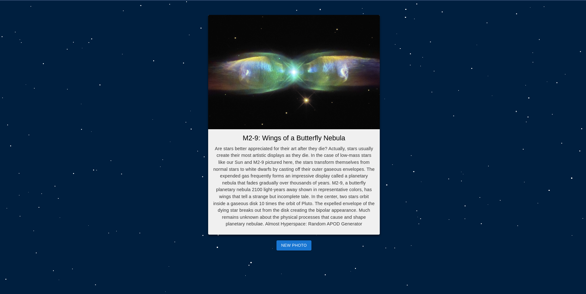

<h1>1hr Hacks - Space Photos</h1>

**Workshop template to cache photos from an API and serve them via FastAPI to a React UI - the demo sample uses the NASA API. Containerized to working state with nginx server.**

[🚀 See the Demo]() &nbsp; [🗒️ Workshop Slides]() &nbsp; [🛠️ Development Notes](#development) &nbsp;

---

## Development Notes

This is a cheatsheet of the development workflow steps.  See the [Workshop Slides]() for full project explainers and instructional materials.

### Environment Setup

Generate an API key for the NASA API at [https://api.nasa.gov/](https://api.nasa.gov/).
Create a file `api/api.env` based on `api/api.env.tamplate` and fill the API key.

To configure the development environment:

1) Install pipenv with 

    `pip install pipenv`

2) Enter the environment with 

    `pipenv shell`

3) Lock and update the package installations with 

    `pipenv update`

### Development Workflow

Run the backend in development mode:

1) Go to the nasa-webapp directory with
   
   `cd nasa-webapp`

2) Run the api with

   `uvicorn nasa_photos:app --reload` to access the endpoint on port 8000 at `http://localhost:8000/photo` and reload automatically on any code changes

Run the frontend in development mode:

1) Go to the `nasa-api` directory with

   `cd nasa-api`

2) If this is the first time running the app locally, install the required packages with

   `npm install`

3) If this is the first time running the app locally or changes have been made to the source code, update the build with

   `npm run build`

4) Run the app with

   `npm start` and follow the localhost link from the output

### Docker Workflow

Build the Docker image containing both components with:

`docker build -t nasa-app .`

And the container with:

`sudo docker run -p 8000:8000 -p 3000:3000 nasa-app` to access the app at `http://localhost:3000`
